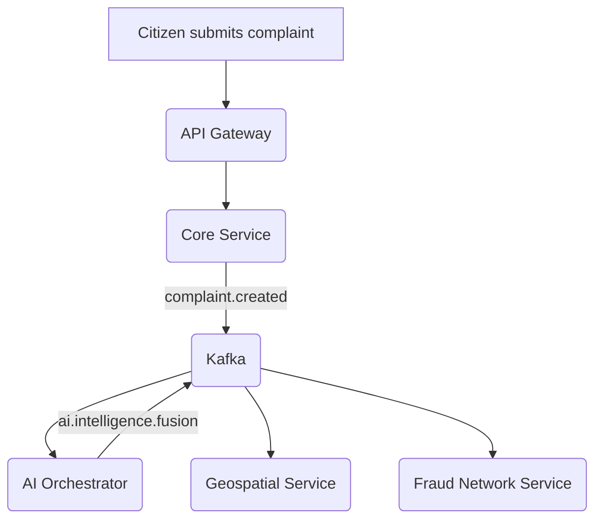

# KAVACH AI Architecture

KAVACH AI is an event-driven, microservices-based intelligence platform designed to ingest citizen complaints, orchestrate AI analysis, compute geospatial hotspots, and link fraud networks in near real-time.

## High-Level Architecture

 <!-- Placeholder for actual diagram -->

### Core Microservices

1. **API Gateway (FastAPI)**
   - **Role**: Single entry point for all frontends (Citizen Portal, Police Dashboard).
   - **Responsibilities**: JWT Authentication, RBAC, request routing, and rate limiting.

2. **Core Intelligence Service (FastAPI + PostgreSQL)**
   - **Role**: Source of truth for complaints and cases.
   - **Responsibilities**: Stores immutable complaint records. Publishes `complaint.created` events to Kafka.

3. **Evidence Vault Service (FastAPI + MinIO + PostgreSQL)**
   - **Role**: Secure, immutable storage for media and documents.
   - **Responsibilities**: Generates presigned MinIO URLs, computes SHA-256 hashes for chain of custody, and links evidence to complaints.

4. **AI Orchestrator (LangGraph + Groq Llama 3.3)**
   - **Role**: The brain of the platform.
   - **Responsibilities**: Subscribes to new complaints, delegates analysis to specialized AI agents (Scam Detection, Threat Fusion, Officer Copilot), and publishes structured intelligence events back to Kafka.

5. **Fraud Network Service (FastAPI + Neo4j)**
   - **Role**: Graph analytics engine.
   - **Responsibilities**: Parses AI intelligence events to extract entities (Phone, UPI, Bank Account) and relationships. Detects multi-hop fraud rings.

6. **Geospatial Intelligence Service (FastAPI + PostGIS)**
   - **Role**: Spatial clustering and hotspot detection.
   - **Responsibilities**: Performs incremental DBSCAN clustering on geo-tagged complaints. Exposes GeoJSON endpoints for map rendering.

7. **National Cyber Command Center (Next.js + React Query)**
   - **Role**: The Visualization Layer.
   - **Responsibilities**: Presents live KPIs, threat maps, fraud graphs, and AI timelines using lightweight polling to gracefully handle partial backend failures.

## Event Flow (Kafka)

